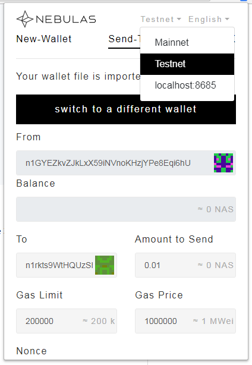
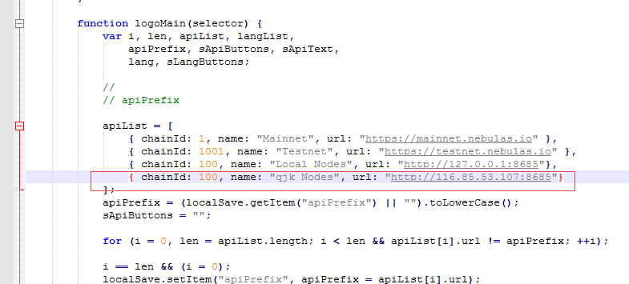
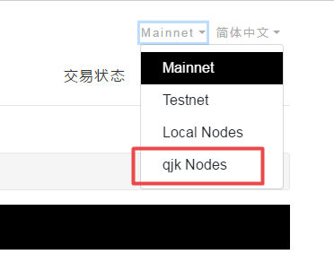

## 钱包插件
星云链的web钱包、chrome钱包插件(WebExtensionWallet)使用起来都挺方便的，但是原生的钱包仅支持连接以下三种网络。
+ MainNet 主网
+ TestNet 测试网
+ LocalHost:8685 本地节点

假如有些小伙伴需要使用钱包连接自己部署的私有链，那就需要改改钱包代码，增加几行配置了。

> **解决办法**

在钱包源代码找到`ui-block.js`这个文件打开，然后搜索字符串Local Nodes，在这个apiList中加入你的私有链连接信息后保存就OK啦。

重启打开钱包后你就会发现多了一项刚才的配置了，在尝试发一笔交易，完美搞定。

