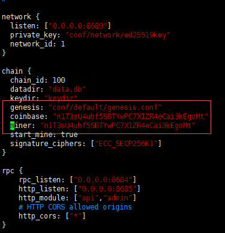

## 私链部署
> **这里以Linux系统为例**  

### 环境搭建

#### GO环境准备 

> 提示: 在golang的开发中，GOPATH是必须的，它指定了我们使用golang开发的工作空间。所有的源码都应放在GOPATH之下。注意的是Go的版本必须>= 1.9.2。
```bash
# download
wget https://dl.google.com/go/go1.9.3.linux-amd64.tar.gz

# extract
tar -C /usr/local -xzf go1.9.3.linux-amd64.tar.gz

# environment variables
export PATH=$PATH:/usr/local/go/bin
export GOPATH=/path/to/workspace
```
#### 安装rocksdb依赖库

+ 首先安装RocksDB所需依赖库
    ```bash
    yum -y install epel-release && yum -y update
    yum -y install gflags-devel snappy-devel zlib-devel bzip2-devel gcc-c++  libstdc++-devel
    ```
* 下载源码并编译安装
    ```bash
    git clone https://github.com/facebook/rocksdb.git
    cd rocksdb && make shared_lib && make install-shared
    ```

#### 安装Go依赖库

在Go-Nebulas中，Go的三方库都通过[Dep](https://github.com/golang/dep)来做管理。

| Components | Version | Description |
|----------|-------------|-------------|
[Dep](https://github.com/golang/dep) | >= 0.3.1 | Dep is a dependency management tool for Go. |

#### 安装Dep工具

* 通过源码来安装Dep
    ```bash
    cd /usr/local/bin/
    wget https://github.com/golang/dep/releases/download/v0.3.2/dep-linux-amd64
    ln -s dep-linux-amd64 dep
    ```
### 编译星云链

#### 下载源码

可以使用如下指令直接下载最新版本的星云链源码。

```bash
# 进入工作目录
mkdir -p $GOPATH/src/github.com/nebulasio
cd $GOPATH/src/github.com/nebulasio

# 下载源码
git clone https://github.com/nebulasio/go-nebulas.git

# 进入项目目录
cd go-nebulas

# 切换到最稳定的master分支
git checkout master
```
#### 下载Go三方库

我们切换到Go-Nebulas项目根目录，然后使用Dep来下载三方库。

```bash
cd $GOPATH/src/github.com/nebulasio/go-nebulas
make dep
```

> 提示: `make dep`将会下载很多依赖库。在部分地区，这个过程可能比较耗时。所以，我们提供了依赖库的压缩包[vendor.tar.gz](http://ory7cn4fx.bkt.clouddn.com/vendor.tar.gz)。可以使用下列指令通过压缩包来安装GO依赖库。
> ```bash
> wget http://ory7cn4fx.bkt.clouddn.com/vendor.tar.gz
> cd $GOPATH/src/github.com/nebulasio/go-nebulas
> tar zxf vendor.tar.gz
> ```

#### 编译可执行文件

完成所有上述依赖库的安装后，现在我们可以进入Go-Nebulas根目录编译星云链的可执行文件了。

```bash
cd $GOPATH/src/github.com/nebulasio/go-nebulas
make build
```

### 运行星云链

#### 创世区块

在启动一个新的星云链前，如果有需要则可以自己定义创世区块的配置文件。

#### 创世区块配置

```protobuf
meta {
  # 每条链的唯一标识
  # 每个区块和交易只会属于一条唯一的链，保证安全性
  # 对于主网，chain_id=1；对于测试网，chain_id=1001
  chain_id: 100
}

consensus {
  # 在贡献度证明(PoD)被充分验证前，星云链采用DPoS共识算法
  # DPoS共识中，21个人组成一个朝代
  # 每隔一段时间都会切换朝代，每个朝代内，21个矿工轮流出块
  # 由于DPoS只是过渡方案，所以暂时不开放给公众挖矿，即当前版本朝代不会发生变更
  dpos {
    # 初始朝代，包含21个初始矿工地址
    dynasty: [
      [ miner address ],
      ...
    ]
  }
}

# 预分配的代币
token_distribution [
  {
    address: [ allocation address ]
    value: [ amount of allocation tokens ]
  },
  ...
]
```

可以在根目录`conf/default/genesis.conf`下，找到一个完整的创世区块配置实例。

#### 配置文件

在启动一个星云节点前，需要定义好该节点的配置文件。

#### 星云节点配置文件

```protobuf
# 网络配置
network {
  # 对于全网第一个节点，不需要配置seed
  # 否则，其他节点启动时需要配置seed，seed节点将会把网络中其他节点的路由信息同步给刚启动的节点
  # 可以配置多个seed, ["...", "..."]
  seed: ["/ip4/127.0.0.1/tcp/8680/ipfs/QmP7HDFcYmJL12Ez4ZNVCKjKedfE7f48f1LAkUc3Whz4jP"]

  # 节点监听网络消息端口，可以配置多个
  listen: ["0.0.0.0:8680"]

  # 网络私钥，用于确认身份节点
  # private_key: "conf/network/id_ed25519"
}

# 链配置
chain {
  # 链的唯一标识
  chain_id: 100

  # 数据存储地址
  datadir: "data.db"

  # 账户keystore文件存储地址
  keydir: "keydir"

  # 创世区块配置
  genesis: "conf/default/genesis.conf"

  # 签名算法，请勿修改
  signature_ciphers: ["ECC_SECP256K1"]

  # 矿工地址，矿工的keystore文件需要放置在配置的keydir下
  miner: "n1XkoVVjswb5Gek3rRufqjKNpwrDdsnQ7Hq"

  # Coinbase地址，该地址用于接收矿工的挖矿奖励，可以和矿工地址一致
  # 该地址的keystore无需暴露，不用放置在配置的keydir下
  coinbase: "n1FF1nz6tarkDVwWQkMnnwFPuPKUaQTdptE"

  # 矿工地址的密码
  passphrase: "passphrase"
}

# API配置
rpc {
    # GRPC服务端口
    rpc_listen: ["127.0.0.1:8684"]

    # HTTP服务端口
    http_listen: ["127.0.0.1:8685"]

    # 开放的API模块
    # API模块包含所有和用户私钥无关的接口
    # Admin模块包含所有和用户私钥相关的接口，需要慎重考虑该模块的访问权限
    http_module: ["api", "admin"]
}

# 日志配置
app {
    # 日志级别: 支持[debug, info, warn, error, fatal]
    log_level: "info"

    # 日志存放位置
    log_file: "logs"

    # 是否打开crash report服务
    enable_crash_report: false
}

# 监控服务配置
stats {
    # 是否打开监控服务
    enable_metrics: false

    # 监控服务将数据上传到Influxdb
    # 配置Influxdb的访问信息
    influxdb: {
        host: "http://localhost:8086"
        db: "nebulas"
        user: "admin"
        password: "admin"
    }
}

```

A lot of examples can be found in `$GOPATH/src/github.com/nebulasio/go-nebulas/conf/`

### 启动星云链

> 这样方式启动的星云链是自己建立的一条的私有链，和其他节点没有任何关联。

```bash
cd $GOPATH/src/github.com/nebulasio/go-nebulas
./neb -c conf/default/config.conf
```

启动成功的话，将会看到如下信息，有`Started Neblet`的日志输出。


默认情况下，使用配置文件`conf/default/config.conf`启动的节点不是矿工节点。

然后启动第一个矿工节点。

```bash
cd $GOPATH/src/github.com/nebulasio/go-nebulas
./neb -c conf/example/miner.conf
```


> 提示: 目前的DPoS共识算法，会有21个节点轮流出块。由于只启动了21个矿工节点中的一个矿工节点，所以每隔15*21s才出一个块。可以同时启动更多的矿工节点，填补的空缺，但需要注意端口避免冲突。

尝试用钱包发送一个交易测试看看服务节点的http服务是否正常启动。  
  
然后等待看看交易最后是否成功，如果是SUCCESS则表明了旷工启动打包区块是正常的。  


## 修改dpos节点数量  
自建私链一般节点数量少于21个，如果按照默认的配置的话15s*21=3分钟才会轮到当前节点再次出块，因此一笔交易最少也要等待5分钟才能够确认，显然这速度太慢了。如果有需要加快确认速度也是可以的，方法就是修改节点数量。

首先，修改`conf/default/genesis.con`的王朝，把21个地址删掉20个，只留下1个。  
  
其次，修改`conf/default/config.conf`的几个地方把旷工地址改了。  
  
再次，修改`conf/example/miner.conf`把旷工地址写成自己的地址，如果是自己新建的账号那么passphrase密码一定要填正确，系统账号默认的密码是*passphrase* 。  
   
最后，还要修改下代码`consensus/dpos/dpos_state.go`，把节点数量改成1。  
   
**需要注意的是，如果你已经编译且运行过代码，此时你还需要做两件事情**  
+ 执行```rm -rf *.db```清除区块信息
+ 执行```make build``` 重新编译代码


## 钱包插件
星云链的web钱包、chrome钱包插件(WebExtensionWallet)使用起来都挺方便的，但是原生的钱包仅支持连接以下三种网络。
+ MainNet 主网
+ TestNet 测试网
+ LocalHost:8685 本地节点


假如有些小伙伴需要使用钱包连接自己部署的私有链，那就需要改改钱包代码，增加几行配置了。

> **解决办法**

在钱包源代码找到`ui-block.js`这个文件打开，然后搜索字符串Local Nodes，在这个apiList中加入你的私有链连接信息后保存就OK啦。   
  
重启打开钱包后你就会发现多了一项刚才的配置了，在尝试发一笔交易，完美搞定。  
  

