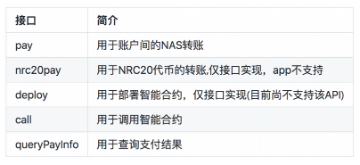
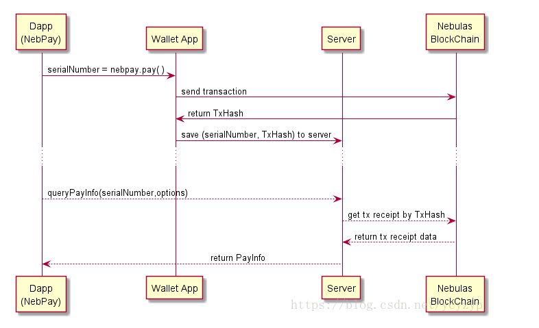

nebPay
===
用户在使用Dapp过程中需要发送交易，但是直接在Dapp中导入钱包文件或输入私钥是极不安全的，所以Nebulas官方提供了一个支付接口NebPay。Dapp开发者可以使用NebPay作为支付通道，来处理sendTransaction的需求。Dapp用户需要安装**Chrom浏览器插件**（PC）或**钱包APP**（移动端）来完成Dapp页面发起的交易请求。

如果Dapp页面需要与Nebulas网络进行其他非交易类的信息交互，比如查询数据、订阅event等，则可以使用neb.js直接与Nebulas网络交互。

>nebPay提供的接口如下  



NebPay 并不关心当前使用的是主网或测试网（默认是选择主网），只是把交易信息发给浏览器插件或手机app，由后者决定将交易发送到哪个网络（所以弹窗里面有个网络选择的tab）。callback参数也只是决定使用哪个服务器查询交易结果，并不会影响交易发送的网络。

代码示例如下：
```JS
<script src="nebPay.js"></script>
<script >
    var NebPay = require("nebpay");
    var nebPay = new NebPay();    
    var serialNumber; //交易序列号
    var intervalQuery; //定时查询交易结果
    //点击按钮发起交易, 这里为调用智能合约的例子
    function onButtonClick() {        
        var to = dappAddress;   //Dapp的合约地址
        var value = "0";
        var callFunction = "" //调用的函数名称
        var callArgs =  ""  //参数格式为参数数组的JSON字符串, 比如'["arg"]','["arg1","arg2]'        
        var options = {
            goods: {        //商品描述
                name: "example"
            },
            //callback 是交易查询服务器地址,
            //callback: NebPay.config.mainnetUrl //在主网查询(默认值)
            callback: NebPay.config.testnetUrl //在测试网查询
        }
        //发送交易(发起智能合约调用),调用交易接口会返回32字节的交易序列号，Dapp端用该序列号查询交易结果
        serialNumber = nebPay.call(to, value, callFunction, callArgs, options);
        //一般用setInterval来定时查询直到查询到结果, 查询周期建议10-15s (因为查询服务器限制最多6次/分钟, nebulas出块周期为15s.)
        intervalQuery = setInterval(function() {
            funcIntervalQuery();
        }, 10000); //建议查询频率10-15s,因为星云链出块时间为15s,并且查询服务器限制每分钟最多查询10次。
    }

    //查询交易结果. queryPayInfo返回的是一个Promise对象.
    function funcIntervalQuery() {   
        //queryPayInfo的options参数用来指定查询交易的服务器地址,(如果是主网可以忽略,因为默认服务器是在主网查询)
        nebPay.queryPayInfo(serialNumber, options)   //search transaction result from server (result upload to server by app)
            .then(function (resp) {
                console.log("tx result: " + resp)   //resp is a JSON string
                var respObject = JSON.parse(resp)
                //code==0交易发送成功, status==1交易已被打包上链
                if(respObject.code === 0 && respObject.data.status === 1){ 
                    //交易成功,处理后续任务....
                    clearInterval(intervalQuery)    //清除定时查询
                }
            })
            .catch(function (err) {
                console.log(err);
            });
    }

</script>
```

> 用户使用钱包插件发起交易的流程图如下  

  
+ 用户发起交易，Dapp调用NebPay接口唤起插件窗口发送交易，此时NebPay立刻生成一串交易序列号Seq（**32位的编码，不是真正的交易序列号**）返回给Dapp。
+ 用户通过App调用NebPay插件确认将交易发送到星云链，星云链返回TxHash（**这才是真正的交易hash64位**）
+ NebPay 将这个TxHash和Seq发送到查询服务器保存
+ 查询服务器不断轮询星云链这个TxHash交易是否成功
+ Dapp调用NebPay的queryPayInfo接口并传入交易序列号Seq查询交易状态（这里一般都是用定时器实现，因为交易确认时间一般十多秒所以定时间间隔也大多十多秒，如果间隔太短了查询服务器会直接拒掉请求的）  